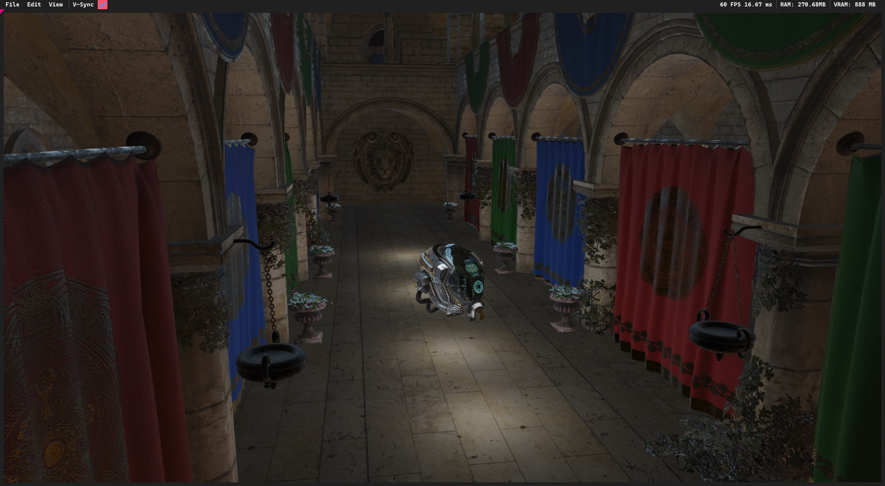

# Lower Deck Engine

Hobby rendering engine built in C++20 - generally a great overhaul of my old projects.

Currently running D3D12 backend only.

Lower Deck is a working name - likely to change it later.

## Features and goals:

- [x] Deferred rendering
- [x] Bindless resources
- [ ] Physically Based Rendering:
    - [x] Epic's UE4 PBR
    - [ ] Disney's PBR
- [x] Image Based Lighting:
    - [x] Diffuse
    - [x] Specular
- [ ] Shadows:
    - [ ] Directional
    - [ ] Point
- [ ] Raytracing:
    - [ ] Shadows
    - [ ] Reflections
- [ ] Model loading:
    - [x] glTF 2.0
    - [ ] glb
    - [x] fbx
    - [ ] obj

## Built with:

- **C++20**
- **CMake**
- **Visual Studio 2022**
- **DirectX Ultimate**
- **vcpkg**
- **Win32 API**

## Third-party

- [**D3D12 Agility SDK**](https://devblogs.microsoft.com/directx/directx12agility/)
- [**D3D12 Memory Allocator**](https://github.com/GPUOpen-LibrariesAndSDKs/D3D12MemoryAllocator)
- [**assimp**](https://github.com/assimp/assimp)
- [**EnTT**](https://github.com/skypjack/entt)
- [**stb_image**](https://github.com/nothings/stb)
- [**ImGui**](https://github.com/ocornut/imgui)
- [**FontAwesome**](https://github.com/juliettef/IconFontCppHeaders)

## Screenshots

